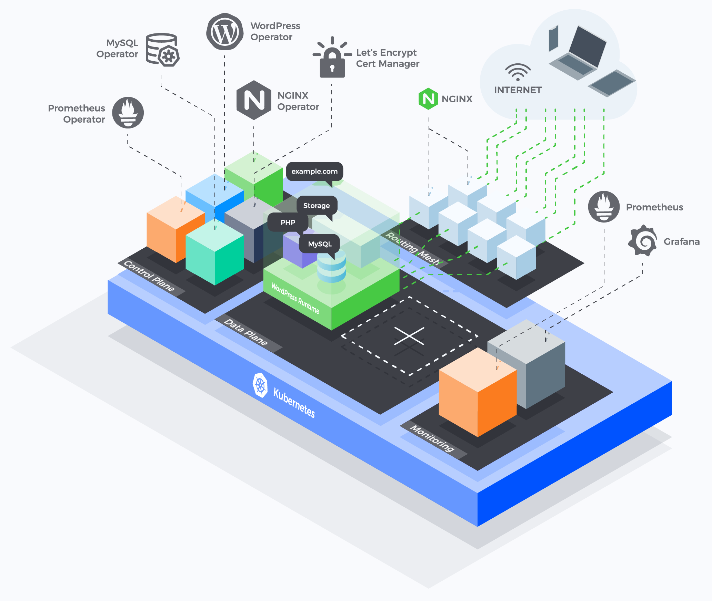

The [Presslabs Stack](https://www.presslabs.com/stack/) is an [open-source project](https://github.com/presslabs/stack) on Github.

All the components of Stack can be viewed in the picture above

It has a control plane made up of:

- [WordPress Operator](https://github.com/presslabs/wordpress-operator) - manages WordPress related operations. From installation and autoscaling, to cronjobs, backups, and upgrades.
- [MySQL Operator](https://www.presslabs.com/code/mysqloperator/) - takes care of all the database operations, from scaling and failovers to backups. Depending on your use-case, you can have one cluster per site or one cluster for multiple sites.
- [Let's Encrypt Cert Manager](https://github.com/jetstack/cert-manager) - takes care of automatically generating TLS certifications and accommodate their renewal
- [Nginx Operator](https://github.com/kubernetes/ingress-nginx) - manage all the NGINX instances that are user-facing

Going further, the data plane represents the actual pods running and its underlying storage. We recommend starting with [stack-wordpress](https://github.com/presslabs/stack-wordpress), but we'll get further into the Runtime a little bit later, since it's tight with deployment.

A system like Stack, with a lot of moving pieces, needs a monitoring system. We choose [Prometheus](https://github.com/coreos/prometheus-operator/compare?expand=1) for metrics storage (managed by the Prometheus operator) and Grafana for visualizations and alerting.
